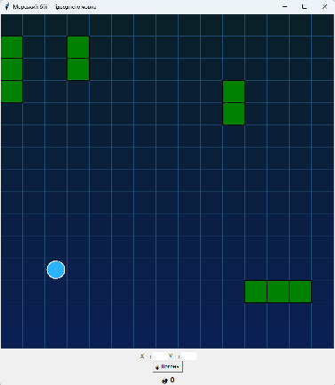

# 🚢 Морський бій: Підводний човен

## 🏆 Мета гри

* Знищити всі кораблі

---

## 🎮 Опис гри

У цій грі ти — капітан підводного човна, який веде бій проти ворожих кораблів.

Твоя мета — **знищити всі кораблі** на полі.

Підводний човен щоразу з’являється у випадковій клітинці координатної сітки.
Після пострілу він одразу змінює свою позицію, щоб залишитися непоміченим.

Для знищення корабля потрібно влучити в **усі його палуби**.

⚠️ Якщо ти:

* влучив у корабель,
* але наступним пострілом промахнувся або влучив в інший корабель,

👉 попередній корабель **відновлюється (регенерує пошкодження)**.

---

## 🚢 Кораблі

* На полі розташовано **4 кораблі**
* Довжина кораблів:
  * 2 клітинки
  * 3 клітинки
* Кораблі можуть бути:
  * горизонтальні
  * вертикальні
* Кораблі **можуть торкатися один одного**

---


## 🚀 Як почати гру

1. Завантаж код гри на свій комп’ютер  
   👉 [⬇ Завантажити `battle_submarine.py`](image_lessons/battle_submarine.py)  
2. Відкрий файл
3. Запусти програму

---

## 🎯 Як стріляти

Ти вводиш два числа:

* `dx` — зміна по осі X (вліво / вправо)
* `dy` — зміна по осі Y (вгору / вниз)

📌 Формула пострілу:

```
ціль = (x + dx, y + dy)
```

де `(x, y)` — поточна позиція підводного човна

---

## 💥 Правила гри

### 🔹 Знищення корабля

Корабель знищується, якщо:

* ти влучив у **всі його клітинки**

Після цього корабель зникає з поля.

---

### 🔹 Важливе правило

Якщо ти:

* почав стріляти по одному кораблю
* але потім промахнувся або влучив в інший

👉 прогрес пошкодження **скидається**

---


## 🧠 Порада

Плануй свої постріли, запам’ятовуй координати та думай стратегічно — це ключ до перемоги 🚀
