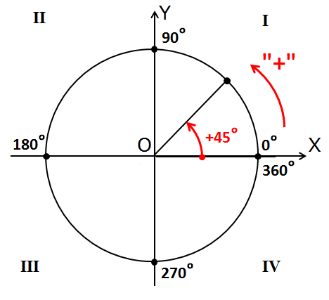

# 🐢 Тема 2. Рух і напрямки черепашки

## 🎯 Мета уроку
- Навчитися керувати рухом черепашки у різних напрямках.  
- Освоїти повороти та побудову кутів.  
- Створювати прості геометричні фігури.  
- Закріпити поняття «кут повороту» та «напрям руху».  
- Розвинути просторове мислення та уявлення про напрямки руху.
---
## 🧩 Теоретичні відомості
Черепашка може рухатися по екрану **вперед** і **назад**, а також змінювати напрям свого руху за допомогою **поворотів**.
### 🔹 Основні команди для руху
| Команда | Опис дії |
|----------|-----------|
| `forward(x)` | рух вперед на `x` пікселів |
| `back(x)`  | рух назад на `x` пікселів |
| `right(a)` | поворот вправо на `a` градусів |
| `left(a)`  | поворот вліво на `a` градусів |

---
## 🔹 Що таке градус?
**Градус (°)** — це одиниця вимірювання кута.  
Один повний оберт дорівнює **360°**.  

- 90° — прямий кут  
- 180° — півоберт  
- 270° — три чверті оберту  
- 360° — повний оберт (черепашка повертається у вихідний напрям)
> Наприклад, команда `left(45)` означає, що черепашка повертає **ліворуч на кут 45°**.


---
## 🌀 Як працюють повороти

- Якщо використовуєш `right(a)` — черепашка повертає **за годинниковою стрілкою**.    
- Якщо `left(a)` — **проти годинникової стрілки**.  
Після кожного повороту черепашка **запам’ятовує новий напрямок**.  
Тобто, коли вона рухається далі, то робить це **вже під новим кутом**.
---
## 🧭 Напрямки руху
Коли програма запускається, черепашка дивиться **вправо** — це напрямок **0°**.

| Напрямок | Поворот | Кут |
|-----------|----------|-----|
| Вправо | початкове положення | 0° |
| Вниз | `right(90)` | 90° |
| Вліво | `right(180)` | 180° |
| Вгору | `right(270)` або `left(90)` | 270°  |

---
## 💻 Приклади. 
### 🔸Повороти вправо і вліво
```python
from turtle import *

forward(100)
right(45)
forward(100)
left(45)
forward(100)

done()
```
Після першої команди черепашка малює пряму горизонтальну лінію довжиною **100 пікселів**.  
Потім повертає **вправо на 45°** і проводить відрізок під кутом вниз.  
Далі повертає **вліво на 45°**, вирівнюється знову горизонтально й малює ще одну пряму.

---

### 🔸Малюємо трикутник
```python
from turtle import *

forward(100)
left(120)
forward(100)
left(120)
forward(100)
left(120)

done()
```
Кожен поворот — на `120° вліво.`  
У результаті виходить рівносторонній трикутник.

## 💡 Корисно знати
* Черепашка не “знає”, що малює фігуру — вона просто рухається та повертає.
* Якщо повернути черепашку на **360°**, вона знову дивиться у той самий бік.

## 🏁 Підсумок
* Черепашка може рухатися вперед і назад, а також повертати ліворуч і праворуч.
* Повороти вимірюються у **градусах**.
* 90° — прямий кут, 180° — півоберт, 360° — повний оберт.
* Використовуючи послідовність команд руху і поворотів, можна створювати різноманітні фігури.
