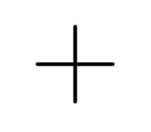
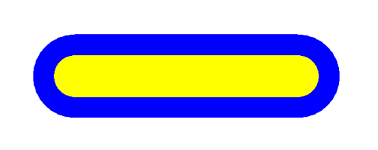
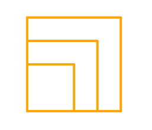
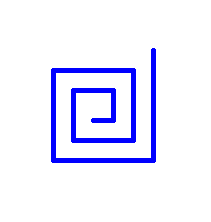
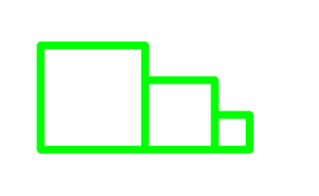
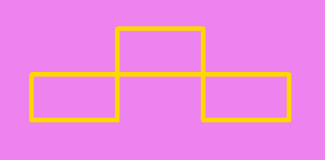
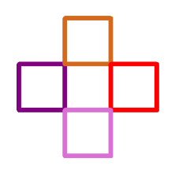

# 🐢 Завдання до теми №1

## 1️⃣ Хрест  
Створи програму, щоб черепашка намалювала **хрест** із двох перпендикулярних ліній довжиною **100 пікселів** кожна.

**Як має виглядати результат** 

---

## 2️⃣ Малюємо лінії  
Напиши програму, щоб черепашка:

1. Намалювала **пряму лінію** довжиною **400 пікселів**, **синім кольором**, із **товщиною лінії 150 пікселів**.  
2. Змінила **товщину пера** на **75 пікселів**, **колір** на **жовтий** і **повернулася назад** на **400 пікселів**.

**Як має виглядати результат** 

---

## 3️⃣ Прямокутник  
Створи програму, щоб черепашка намалювала **прямокутник розміром 100×200 пікселів**.  
- Кожна сторона повинна мати **свій колір**.  
- Товщина лінії — **45 пікселів**.

**Як має виглядати результат** 

---

## 4️⃣ Три квадрати  
Намалюй **три квадрати помаранчевого кольору**, які мають **спільний нижній лівий кут**:  
- **Перший квадрат** — сторона **100 пікселів**, товщина лінії **10 пікселів**.  
- Кожен наступний квадрат має сторону, **більшу на 50 пікселів**.

**Як має виглядати результат** 

---

## 5️⃣ Спіральний лабіринт  
Створи **спіраль із десяти кроків**, дотримуючись таких правил:  
1. Черепашка рухається **вперед на 20 пікселів**.  
2. Повертає **ліворуч на 90°**.  

Повторює це **10 разів**.
Причому кожен раз, коли черепашка рухається у перед, вона збільшує свій крок на 10 пікселів від попереднього разу.  

**Параметри:**
- Форма черепашки — `"classic"`  
- Колір пера — **синій**  
- Товщина лінії — **5 пікселів**

**Як має виглядати результат** 

---

## 6️⃣ Сходи  
Створи **сходинки з трьох прямокутників**, де кожен наступний:

- **зміщений вправо**,  
- має **меншу висоту**.  

Розміри, кольори та товщину лінії обери **на власний розсуд**.

**Як має виглядати результат** 

---

## 7️⃣ Потрійна рамка  
Намалюй **три прямокутники** розміром **200×300 пікселів**, які **дотикаються кутами**.  
- Товщина лінії — **8 пікселів**  
- Колір — **золотий**

**Як має виглядати результат** 

---

## 8️⃣ Чотири квадрати по колу  
Намалюй **чотири квадрати**, розташованих **по колу**, кожен квадрат торкається своїми кутами два інших квадрати.  
- Використай **різні кольори** для кожного квадрата.

**Як має виглядати результат** 

