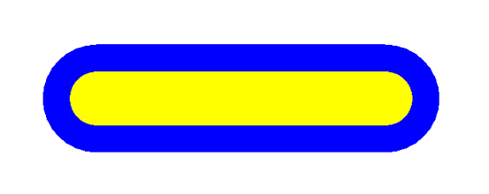
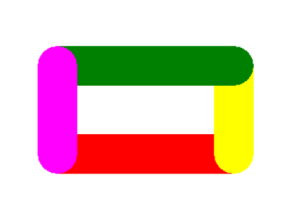
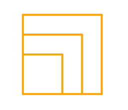
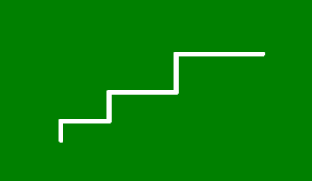
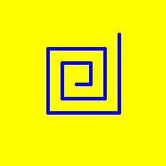
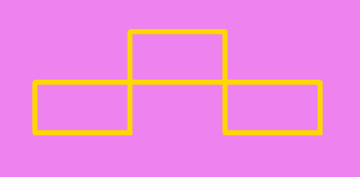

# 🐢 Завдання до теми №1

## 1️⃣ Хрест  
Створи програму, щоб черепашка намалювала **хрест** із двох перпендикулярних ліній довжиною **100 пікселів** кожна.

### Як має виглядати результат 

---

## 2️⃣ Малюємо лінії  
Напиши програму, щоб черепашка:

1. Намалювала **пряму лінію** довжиною **400 пікселів**, **синім кольором**, із **товщиною лінії 150 пікселів**.  
2. Змінила **товщину пера** на **75 пікселів**, **колір** на **жовтий** і **повернулася назад** на **400 пікселів**.

### Як має виглядати результат 

---

## 3️⃣ Прямокутник  
Створи програму, щоб черепашка намалювала **прямокутник розміром 100×200 пікселів**.  
- Кожна сторона повинна мати **свій колір**.  
- Товщина лінії — **45 пікселів**.

### Як має виглядати результат  

---

## 4️⃣ Три квадрати  
Намалюй **три квадрати помаранчевого кольору**, які мають **спільний нижній лівий кут**:  
- **Перший квадрат** — сторона **100 пікселів**, товщина лінії **10 пікселів**.  
- Кожен наступний квадрат має сторону, **більшу на 50 пікселів**.

### Як має виглядати результат 

---

## 5️⃣ Сходинки

Створи *3 сходинки* за такими параметрами:

- Перша сходинка — 50 пікселів
- Висота — 20 пікселів
- Кожна наступна сходинка більша на 20 пікселів
- Висота кожної наступної сходинки більша на 10 пікселів
- Фон: зелений
- Товщина лінії: 5 пікселів
- Колір лінії: білий
- Форма черепашки: "triangle"

### Як має виглядати результат 

---

## 6️⃣ Спіральний лабіринт
Створи спіраль із десяти кроків за такими правилами:

1. Черепашка рухається вперед на 20 пікселів
2. Повертає ліворуч на 90°
3. Повторює це 10 разів, збільшуючи довжину кожного наступного кроку на 10 пікселів

### Параметри:
- Фон полотна: жовтий
- Форма черепашки: "turtle"
- Колір пера: синій
- Товщина лінії: 5 пікселів
- Наприкінці програми: приховай черепашку

### Як має виглядати результат

---

## 7️⃣ Потрійна рамка
Створи три прямокутники розміром 200×300 пікселів, які дотикаються кутами.

### Параметри:
- Товщина лінії: 8 пікселів
- Колір лінії: "gold"
- Фон: "violet"
- Форма черепашки: "square"
- Швидкість черепашки: 3
- Наприкінці програми: приховай черепашку

### Як має виглядати результат 

---

## 8️⃣ Чотири квадрати по колу  
Намалюй чотири квадрати, розташованих по колу, так щоб кожен квадрат торкався своїми кутами двох інших.

### Параметри:
- Кольори квадратів: різні (на власний смак)
- Товщина ліній: 10 пікселів
- Фон: білий
- Форма черепашки: "circle"
- Швидкість черепашки: 4
- Наприкінці програми: приховай черепашку

### Як має виглядати результат 

## 9️⃣ Завдання із зірочкою ⭐

Придумай **свій власний малюнок** і опиши коротку інструкцію для його створення (послідовність дій для черепашки).  

#### **Твоя інструкція має містити такі елементи:**  
- **Фон малюнку**  
- **Колір лінії**  
- **Товщина лінії**  
- **Розміри фігури**  
- **вигляд черепашки та її швидкість**
- ...

#### **Після цього:**  
1. Створи програму для свого малюнка.  
2. Збережи файл програми (наприклад, `my_art.py`).  
3. Відправ на перевірку свою програму разом з описом програми у Classroom.  

**Порада:**  
>- Можеш використовувати будь-які відомі тобі команди `turtle` для створення фігур.  
>- Постарайся зробити малюнок цікавою комбінацією форм, кольорів і розмірів.  

### Як має виглядати результат:  
> Залежить від твоєї фантазії — тут немає одного правильного варіанту!