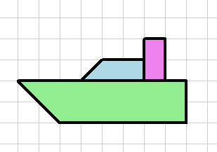
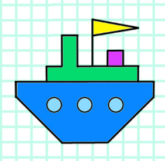

# 🌊 Черепашкова регата

У далекому **морі алгоритмів** є невелика, але дуже важлива **Бухта програмістів**.  
Саме тут створюють **найкращі кораблі для великих морських подорожей**.

Але одного дня сталася проблема…

🌩 **Старий флот бухти зник** під час великого **шторму коду**.  
Тепер бухта залишилась **без жодного корабля**.

---

## ⚓ Нова надія

І саме **вас призначили капітанами бухти** ⚓

Ваше завдання — **створити новий флот кораблів**.

Але будувати їх потрібно **особливим способом** —  
за допомогою **мови програмування Python**  
та чарівної **черепашки Turtle 🐢**.

---

## 🏁 Великий фінал

Коли флот буде готовий —  
ми відправимось у **Велику Черепашкову регату** ⛵

## 🟢 Місія 1 — Сторожовий катер

Перш ніж створювати великий флот, бухті потрібен **сторожовий катер**.  
Саме він першим виходить у море, щоб **охороняти порт і перевіряти безпеку вод**.

### ⚓ Завдання 
**Намалювати сторожовий катер за допомогою Python Turtle**.

### Як має виглядати результат 

---

## 🔵 Місія 2 — Патрульний корабель

Сторожовий катер успішно вийшов у море та повідомив хороші новини:  
води навколо **Бухти програмістів** безпечні. 🌊

Тепер бухті потрібен **більший корабель**, який зможе патрулювати море  
та охороняти торгові шляхи.

Ваше нове завдання — **створити патрульний корабель**.

### ⚓ Завдання

Намалюйте корабель, подібний до зразка, який складається з кількох частин

### Як має виглядати результат 

---