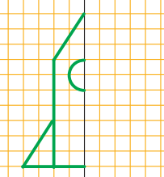
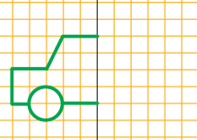

# 🌊 Черепашкова регата — продовження

## 🔵 Місія 3 — Твій улюблений предмет

Після створення перших кораблів команда відпочиває у **Бухті програмістів** 🌊  

Але капітан має нове завдання —  
кожен учасник повинен створити **власний унікальний малюнок**.

І не просто малюнок…  
а малюнок **по клітинках**, як справжній програміст 🎯

---

## ⚓ Завдання

Намалюйте **свій улюблений предмет** за допомогою Python Turtle 🐢  
використовуючи **сітку (малювання по клітинках)**.

---

## 🎨 Важливі умови

🔹 Малюнок має бути зроблений **по клітинках (grid)**  
🔹 Використайте **мінімум 3 різні кольори**  
🔹 Малюнок має складатися **з кількох частин (не одна фігура)**  

---

## 🏁 Мета місії

Показати, що ви:
- вмієте працювати з координатами 📍  
- можете малювати **по сітці**  
- створюєте **власні креативні роботи**

---

💡 *Порада від капітана:*  
Спочатку намалюйте свій предмет **на папері в клітинку**,  
а потім перенесіть його у програму 😉

## 🚀 Місія 4 — Сигнальна ракета

Патрульний корабель виконав свою місію та повернувся до бухти з важливими новинами… 📡  

На горизонті помітили **невідомий об’єкт**, який рухається дуже швидко.  
Щоб подати сигнал та дослідити ситуацію, потрібно запустити **сигнальну ракету** 🚀  

Але є проблема…  

📏 Креслення ракети збереглися лише половина, а відхилення навіть на одну клітинку може зіпсувати запуск!  

---

### ⚓ Завдання

Намалюйте та розфарбуйте ракету за зразком,  
дотримуючись **точних координат по клітинках**.

### Частинна креслення

## 🟣 Місія 5 — Ремонтна станція

Після запуску сигнальної ракети Ви отримали відповідь… 📡  

У космосі вони виявили **пошкоджену ремонтну станцію**,  
яка колись обслуговувала кораблі Бухти програмістів.  

Але станція частково зруйнована,  
і щоб вона знову запрацювала — її потрібно **відновити за кресленням** 🛠  

І, як завжди… креслення залишилось лише у вигляді **сітки з клітинок**.

### ⚓ Завдання

Намалюйте та розфарбуйте об’єкт за зразком,  
дотримуючись **точних координат по клітинках**.

### Частинна креслення

---
