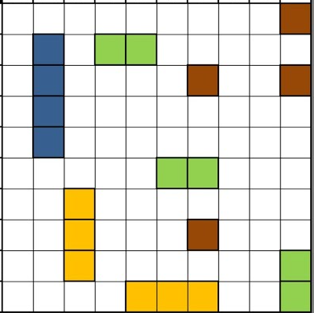

# ⚓ Місія — Морський бій

### 📜 Історія

Капітани кораблів у Бухті програмістів не лише подорожують морями алгоритмів, а й дуже люблять грати у **морський бій** 🚢

Перед початком гри кожен капітан повинен підготувати своє поле:
намалювати **карту гри** та правильно **розставити кораблі**.

Але є важливе правило ☝️  
Кораблі потрібно розташувати **за всіма правилами морського бою**, щоб гра була чесною.

---

## ⚓ Завдання

Створіть у Python Turtle малюнок поля для гри **«Морський бій»**.

Потрібно:

- намалювати ігрову карту-сітку;
- розмістити на полі кораблі;
- дотриматися правил розташування кораблів;
- зафарбувати кораблі у кольори.

---

## 📌 Правила розташування кораблів

На полі мають бути такі кораблі:

- **1 корабель** на 4 клітинки;
- **2 кораблі** на 3 клітинки;
- **3 кораблі** на 2 клітинки;
- **4 кораблі** на 1 клітинку.

Усі кораблі потрібно розташувати так, щоб вони:

- не виходили за межі поля;
- не накладалися один на одного;
- не торкалися між собою навіть кутами.

---

## 🎨 Умови оформлення

- Поле має бути кольору **морської хвилі**.
- Контур клітинок і кораблів має бути **темно-коричневого кольору**.
- Товщина контуру — **5 пікселів**.
- Розмір однієї клітинки — **27 пікселів**.
- Кораблі однакової довжини мають бути **одного кольору**.

---

### **Один з варіантів карти гри "Морський бій"**

