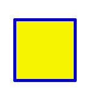
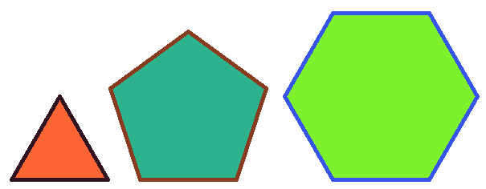
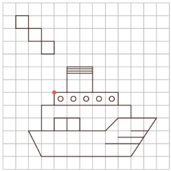

# Завдання до теми: Цикли — магія повторення 🔁🐢  

---

### 1️⃣ TASK_01
Створи програму, у якій черепашка намалює **заповнений квадрат** за допомогою циклу.

⚠️ Важливі умови: 

- Заборонено повторювати однакові команди вручну  
- Використовуй цикл `for`  
- Використай команди `begin_fill()` і `end_fill()`  

### 🔧 Параметри:
- Довжина сторони: `100`
- Колір контуру: синій
- Колір заповнення: жовтий
- Товщина лінії: 5 пікселів

### Як має виглядати результат 

---

### 2️⃣ TASK_02
Створи програму, у якій черепашка намалює **трикутник, п’ятикутник і шестикутник** за допомогою циклів.

⚠️ Важливі умови:  
- Використовуй цикл `for`  
- Для кожної фігури правильно обчисли кут повороту  
- Кожна фігура повинна мати **різний колір контуру та заповнення**  
- Фігури не повинні накладатися одна на одну  

### 🔧 Параметри:
- Довжина сторони: `120`
- Кольори: обери самостійно
- Товщина лінії: 5 пікселів

### Як має виглядати результат 

<!--

---

### 3️⃣ TASK_03
Створи програму, у якій черепашка намалює п’ятикутник.

⚠️ Важливі умови:  
- Використовуй цикл  
- Самостійно обчисли кут повороту  

### 🔧 Параметри:
- Довжина сторони: `80`
- Колір лінії: фіолетовий
- Товщина лінії: 5 пікселів
- Швидкість: 3

### Як має виглядати результат 

---

### 4️⃣ TASK_04
Створи програму, у якій черепашка намалює багато квадратів, повертаючись після кожного.

⚠️ Важливі умови:  
- Використовуй цикл  
- Після кожного квадрата роби поворот  
- Квадрати мають утворювати візерунок  

### 🔧 Параметри:
- Кількість квадратів: `12`
- Довжина сторони: `80`
- Поворот після квадрата: `30°`
- Колір лінії: синій
- Товщина лінії: 3 пікселі
- Швидкість: 5

### Як має виглядати результат 

---

### 5️⃣ TASK_05
Створи програму, у якій черепашка намалює орнамент із квадратів (вкладені цикли).

⚠️ Важливі умови:  
- Використовуй вкладені цикли  
- Один цикл відповідає за квадрат  
- Інший — за повторення фігури  

### 🔧 Параметри:
- Кількість повторів: `10`
- Довжина сторони: `70`
- Поворот після фігури: `36°`
- Колір лінії: чорний
- Товщина лінії: 3 пікселі
- Швидкість: 0 (максимальна)

### Як має виглядати результат 

---

### 6️⃣ TASK_06
Створи програму, у якій черепашка намалює спіраль.

⚠️ Важливі умови:  
- Використовуй цикл  
- Довжина лінії повинна збільшуватись  

### 🔧 Параметри:
- Початкова довжина: `10`
- Крок збільшення: `+5`
- Кількість кроків: `40`
- Кут повороту: `30°`
- Колір лінії: червоний
- Товщина лінії: 2 пікселі
- Швидкість: 0

### Як має виглядати результат 

---

### 7️⃣ TASK_07
Створи програму, у якій черепашка намалює зірковий візерунок.

⚠️ Важливі умови:  
- Використовуй цикл  
- Кут повороту не стандартний (експериментуй)  

### 🔧 Параметри:
- Довжина: `150`
- Кут повороту: `144°`
- Кількість повторів: `10`
- Колір лінії: жовтий
- Товщина лінії: 3 пікселі
- Швидкість: 0

### Як має виглядати результат 

---

### 8️⃣ TASK_08
Створи власний унікальний малюнок.

⚠️ Важливі умови:  
- Використовуй хоча б один цикл  
- Використовуй кольори  
- Малюнок має бути складніший за попередні  

### 🔧 Параметри:
- Обери самостійно  

### Як має виглядати результат 
🎨 Твоя фантазія!

-->