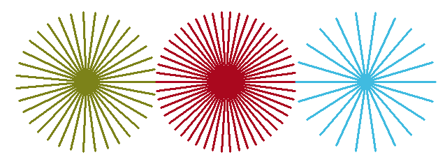
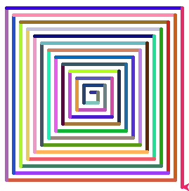

# Завдання до теми: Цикли — магія повторення 🔁🐢  

---

## 1️⃣ TASK_01
Створи програму, у якій черепашка намалює **заповнений квадрат** за допомогою циклу.

⚠️ Важливі умови: 

- Заборонено повторювати однакові команди вручну  
- Використовуй цикл `for`  
- Використай команди `begin_fill()` і `end_fill()`  

### 🔧 Параметри:
- Довжина сторони: `100`
- Колір контуру: синій
- Колір заповнення: жовтий
- Товщина лінії: 5 пікселів

### Як має виглядати результат 

---

## 2️⃣ TASK_02
Створи програму, у якій черепашка намалює **трикутник, п’ятикутник і шестикутник** за допомогою циклів.

⚠️ Важливі умови:  
- Використовуй цикл `for`  
- Для кожної фігури правильно обчисли кут повороту  
- Кожна фігура повинна мати **різний колір контуру та заповнення**  
- Фігури не повинні накладатися одна на одну  

### 🔧 Параметри:
- Довжина сторони: `120`
- Кольори: обери самостійно
- Товщина лінії: 5 пікселів

### Як має виглядати результат 

## 3️⃣ TASK_03 — ⭐ Зірки

#### 📌 Умова:
Намалюй **3 зірки**, у яких:
- кількість променів випадкова (від 3 до 20)
- кожна зірка має випадковий колір

---

#### ⚠️ Умови:
- ✅ Використовуй цикл `for`
- ❌ Не повторюй однакові команди вручну
- ✅ Обчисли кут повороту
- ✅ Використай випадкові числа

#### 🔧 Параметри:
- Довжина лінії: `150`
- Кількість зірок: `3`
- Кількість променів: від `3` до `20`
- Колір: випадковий

#### 💡 Підказка:
Кут повороту можна знайти так: 360 / n  
n - кількість променів у зірці  

### Як має виглядати результат 

---

## 4️⃣ TASK_04 — 🌈 Кольоровий вихор

### 📌 Умова:
Намалюй **спіраль**, у якій:
- кожна нова лінія довша за попередню
- колір змінюється на кожному кроці

---

## ⚠️ Умови:
- ✅ Використовуй цикл `for`
- ❌ Не повторюй команди вручну
- ✅ Довжина лінії має **збільшуватись**
- ✅ Колір змінюється на кожному кроці

## 🔧 Параметри:
- Початкова довжина: `10`
- Кількість кроків: `50`
- Кут повороту: `90°`
- Кольори: випадкові

### Як має виглядати результат 

---
