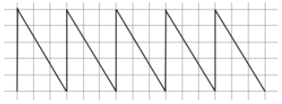
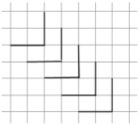
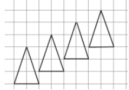

# Завдання до теми:   
## Цикли та допоміжні змінні 🔁🐢  

---

### 1️⃣ TASK_01
Намалюйте фігуру, зображену на малюнку, використовуючи алгоритм з циклом.

⚠️ Важливі умови: 

- Заборонено повторювати однакові команди вручну  
- Використовуйте цикл `for`  
- Для зручності використовуйте фон у клітинку  
- Використовуйте допоміжні змінні  

### Як має виглядати результат 

---

### 2️⃣ TASK_01
Намалюйте фігуру, зображену на малюнку, використовуючи алгоритм з циклом.

⚠️ Важливі умови: 

- Заборонено повторювати однакові команди вручну  
- Використовуйте цикл `for`  
- Для зручності використовуйте фон у клітинку  
- Використовуйте допоміжні змінні  

### Як має виглядати результат 

### 3️⃣ TASK_03
Намалюйте фігуру, зображену на малюнку, використовуючи алгоритм з циклом.

⚠️ Важливі умови: 

- Заборонено повторювати однакові команди вручну  
- Використовуйте цикл `for`  
- Для зручності використовуйте фон у клітинку  
- Використовуйте допоміжні змінні  

### Як має виглядати результат 
