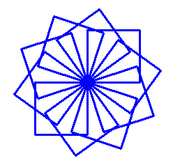
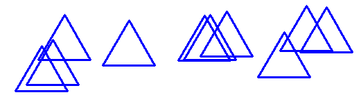
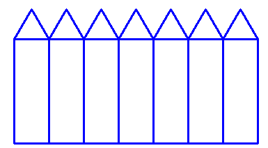
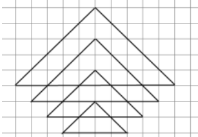

# Завдання до теми:
## Власні функції — створюємо нові команди 🛠️🐢

---

### 1️⃣ TASK_01

Створіть власну функцію `square()`, яка малює квадрат.

Потім використайте цю функцію разом із циклом, щоб намалювати красивий візерунок із квадратів, що повертаються навколо спільного центру.

⚠️ Важливі умови:

- Створіть функцію `square()`
- Квадрат повинен малюватися за допомогою циклу `for`
- Заборонено копіювати код квадрата кілька разів
- Для побудови візерунка використовуйте ще один цикл
- Після кожного квадрата повертайте черепашку на однаковий кут

💡 Підказка:

Якщо потрібно намалювати `n` квадратів по колу, кут повороту можна знайти так:

```python
360 / n
```

### Як має виглядати результат



---

### 2️⃣ TASK_02

Створіть власну функцію `triangle()`, яка малює правильний трикутник.

Потім використайте цю функцію разом із циклом, щоб намалювати трикутники у випадкових місцях екрана.

⚠️ Важливі умови:

- Створіть функцію `triangle()`
- Трикутник повинен малюватися за допомогою циклу `for`
- Заборонено копіювати код трикутника вручну
- Використовуйте цикл для багаторазового виклику функції
- Після кожного трикутника переміщуйте черепашку у випадкову точку
- Для генерації випадкових координат використовуйте `randint()`

💡 Підказка:

Для випадкових координат можна використати:

```python
from random import randint

x = randint(-300, 300)
y = randint(-300, 300)
```

### Як має виглядати результат



📌 У результаті на екрані повинні з'явитися трикутники, розташовані у випадкових місцях, наче черепашка розсипала їх по всьому полю.

---

### 3️⃣ TASK_03

Тобі потрібно створити паркан, використовуючи 3 власні функції. 🏡🐢

Кількість елементів паркану можна регулювати за допомогою змінної:

```python
n = 7
```


```python
rectangle()
triangle()
fence()
```

Функція `rectangle()` повинна малювати прямокутник.

Функція `triangle()` повинна малювати трикутник.

Функція `fence()` повинна використовувати обидві попередні функції для побудови одного елемента паркану.

Потім за допомогою циклу намалюйте цілий паркан.

⚠️ Важливі умови:

- Створіть функцію `rectangle()`
- Створіть функцію `triangle()`
- Створіть функцію `fence()`
- Функція `fence()` повинна викликати функції `rectangle()` та `triangle()`
- Для побудови всього паркану використовуйте цикл `for`
- Заборонено копіювати код квадрата та трикутника вручну
- Після кожного елемента паркану переміщуйте черепашку вправо

💡 Підказка:

Порядок створення програми:

1. Створіть функцію `rectangle()`
2. Створіть функцію `triangle()`
3. Створіть функцію `fence()`, яка викликає:

```python
rectangle()
triangle()
```

4. За допомогою циклу намалюйте багато секцій паркану.

### Як має виглядати результат



📌 У результаті повинен утворитися паркан із однакових секцій.

Кожна секція будується функцією `fence()`, а сама функція використовує дві інші функції — `rectangle()` та `triangle()`

---

### 4️⃣ TASK_04

Намалюйте фігуру, зображену на малюнку, використовуючи змінні в циклі та функції з параметром.

⚠️ Важливі умови:

- Створіть власну функцію triangle(size);
- Функція triangle(size) повинна малювати рівнобедрений трикутник заданого розміру;
- Для побудови всієї фігури використовуйте багаторазовий виклик функції triangle(size);
- Використовуйте цикл for для створення всіх рівнів фігури;
- За допомогою допоміжних змінних змінюйте розмір трикутників та їхнє положення;
- Після малювання кожного трикутника переміщуйте черепашку вниз і вправо так, щоб утворився візерунок, зображений на малюнку;
- Для зручності використовуйте фон у клітинку;
- Використовуйте допоміжні змінні для зберігання поточного розміру фігури та координат черепашки.


### Як має виглядати результат 


---

### 5️⃣ TASK_05

Створіть функцію `star(size, n)`, яка малює зірку з `n` променями.

Потім використайте її, щоб намалювати зоряне небо із зірками різних розмірів у випадкових місцях екрана.

⚠️ **Важливі умови:**

* Задайте колір фону за допомогою команди `bgcolor()`;
* Створіть функцію `star(size, n)`;
* Зірка повинна малюватися за допомогою циклу `for`;
* Використовуйте параметр `size` для зміни розміру зірки;
* Використовуйте параметр `n` для задання кількості променів (кутів) зірки;
* Для побудови зоряного неба використовуйте цикл;
* Після малювання кожної зірки переміщуйте черепашку у випадкову точку;
* Для генерації випадкових координат і розмірів використовуйте функції `randint()` та `choice()`;
* Використовуйте лише непарні значення `n`.

💡 **Підказка:**

```python
from random import randint, choice

x = randint(-300, 300)
y = randint(-250, 250)

size = randint(20, 80)
n = choice([5, 7, 9, 11])
```

### Як намалювати зірку

```python
for i in range(n):       
    forward(size)
    left(180 + 180 / n)
```

📌 У результаті повинно утворитися зоряне небо із зірками різного розміру та з різною кількістю променів.
