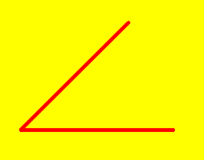
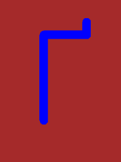
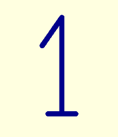
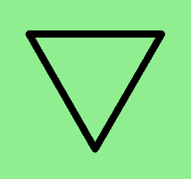
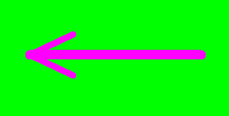
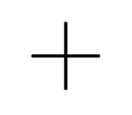

# 🐢 Завдання до теми №2. Рух і напрямки черепашки

## 1️⃣ Кут 45°
Створи програму, щоб черепашка намалювала **Кут 45°**.

### Параметри:

- Кожна лінія має довжину **300 пікселів**;    
- Колір пера — **червоний**;    
- Товщина — **7 пікселів**;  
- Фон - **жовтий**

### Як має виглядати результат

---

## 2️⃣ Буква "Ґ"
Створи програму, у якій черепашка намалює велику **букву "Ґ"**.  

* Спочатку намалюй вертикальну лінію (висота — 200 пікселів).  
* Потім поверни праворуч і намалюй верхню горизонтальну лінію (довжина — 100 пікселів).  
* В кінці додай коротку ***рисочку під кутом 90°*** угорі праворуч (довжина — 30 пікселів).  

### Параметри:
- Колір лінії — **синій**  
- Товщина пера — **20**  
- Фон — **коричневий**  

### Як має виглядати результат 

---

## 3️⃣ Цифра "1"

Створи програму, у якій черепашка намалює **цифру "1"**.

### Підказка:
Цифра “1” має **вертикальну лінію**, **маленьку основу внизу** та **коротку похилу лінію зверху**.

1️⃣ Намалюй **горизонтальну основу** внизу (довжина — 80 пікселів).  
2️⃣ Потім намалюй **вертикальну лінію** (довжина — 280 пікселів).  
3️⃣ Почни з короткої **верхньої похилої лінії** (довжина — 100 пікселів, кут — 35°).

### Параметри:
- Колір лінії — **"darkblue"**  
- Товщина пера — **15**  
- Фон — **"lightyellow"**  

### Як має виглядати результат 

## 4️⃣ Рівносторонній трикутник

Створи програму, у якій черепашка намалює рівносторонній трикутник з такими параметрами:

### 🔧 Параметри:

- Фон: світло-зелений
- Колір лінії: чорний
- Товщина лінії: 17 пікселів
- Форма черепашки: "turtle"
- Швидкість: 1

### 📏 Розміри та положення:

**Сторона трикутника:** 325 пікселів  
**Положення:** трикутник повернутий так, що одна вершина внизу, а основа — **зверху**.  

### Як має виглядати результат 

---

## 5️⃣ Стрілка ліворуч
Створи програму, у якій черепашка намалює стрілку, що показує ліворуч.

Стрілка складається з довгої горизонтальної лінії *(250 пікселів)* та двох коротких похилих ліній *(70 пікселів)*, кут між ними *(50 градусів)*

### Параметри:
- Колір пера — **"magenta"**  
- Фон — **"lime"**  
- Товщина горизонтальної лінії — **14 пікселів**
- Товщина похилих ліній — **10 пікселів**

### Як має виглядати результат 

---

## 6️⃣ Паралелограм
Створи програму, у якій черепашка намалює паралелограм із сторонами 120 та 240 пікселів та кутом 75°.

**Паралелограм** — це чотирикутник, у якого протилежні сторони *паралельні та рівні*.

### Параметри:
- Колір — **"goldenrod"**  
- Фон - **"cyan"**
- Товщина — **6 пікселів**
- Швидкість - 1
- Вигляд - "turtle"

### Як має виглядати результат 

---

## 7️⃣ Ромб
Створи програму, у якій черепашка намалює ромб зі сторонами 200 пікселів та гострим кутом 60°.

Ромб — це паралелограм, у якого всі сторони рівні.

### Параметри:
- Колір — **"orchid"**
- Фон — **"lightyellow"**
- Товщина — **6 пікселів**
- Швидкість — **2**
- Вигляд — **"turtle"**

### Як має виглядати результат 

---

## 8️⃣ Відкритий конверт
Створи програму, у якій черепашка намалює відкритий конверт — квадрат із трикутним “клапаном”, піднятим угору.

Сторони квадрата та трикутника, з яких складається відкритий конверт, дорівнюють **200 пікселів**.
Діагоналі квадрата мають довжину приблизно **283 пікселі**.

### Параметри:
- Колір — **"saddlebrown"**
- Фон — **"mintcream"**
- Товщина — **10 пікселів**
- Швидкість — **1**
- Вигляд — **"turtle"**
### Додаткові умови:
Черепашці **заборонено ходити по вже намальованих лініях**, тому продумай її рухи заздалегідь.
Спробуй, щоб вона малювала фігуру **оптимальним маршрутом** — без зайвих повторів і повернень.

### Як має виглядати результат 

---

<!--
## 9️⃣ Завдання із зірочкою ⭐  
Створи власний малюнок, який показує різні напрямки руху черепашки.

#### У твоїй програмі має бути:
- щонайменше 5 ліній;  
- повороти під різними кутами;  
- різні кольори ліній;  
- черепашка повинна змінювати свій напрямок кілька разів.

📘 Опиши коротко свою ідею: що малює черепашка, які кути та кольори ти використав.  
Потім створи програму й збережи її у файлі `my_directions_art.py`.

-->