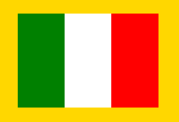
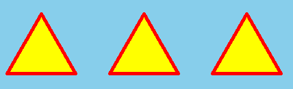
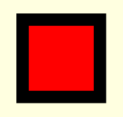
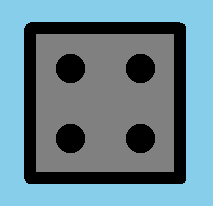

# 🐢 Завдання до теми №3. 

## 1️⃣ Прапор України
Створи програму, у якій черепашка намалює прапор України з правильними пропорціями та заливкою.

Прапор складається з двох рівних горизонтальних смуг:  
- верхня — синя,  
- нижня — жовта.  

### Параметри:
- Ширина прапора: 300 пікселів
- Висота прапора: 200 пікселів
- Фон: білий

### Як має виглядати результат

---
## 2️⃣ Прапор Італії
Створи програму, у якій черепашка намалює прапор Італії — три вертикальні смуги однакового розміру.

Прапор складається з трьох прямокутників:
- ліва смуга — зелена
- середня смуга — біла
- права смуга — червона

### Параметри:
- Ширина прапора: 300 пікселів
- Висота прапора: 200 пікселів
- Фон: золотий

### Як має виглядати результат

---
## 3️⃣ Три трикутники
Створи програму, щоб черепашка намалювала по центру екрана три рівносторонні трикутники.

### Параметри:
- Довжина сторони — 100 пікселів  
- Відстань між трикутниками - 50 пікселів  
- Колір лінії — **червоний**  
- Колір заливки — **жовтий**  
- Товщина пера — 5 пікселів  
- Фон — **світло блакитний**  

### Як має виглядати результат

---

## 4️⃣ Квадратна кнопка
Створи програму, у якій черепашка намалює кнопку у вигляді квадрата з кольоровою заливкою.
На світло-жовтому фоні червона кнопка з чорною рамкою.  
Червоний квадрат менший на **50 пікселів** за зовнішній чорний.

### Параметри:
- Довжина сторони — 180 пікселів
- Фон — **світло-жовтий**  

### Як має виглядати результат

---

## 5️⃣ Кругла кнопка в квадратному полі

Створи програму, у якій черепашка намалює круглу кнопку, що розташована всередині квадратного поля.
Кнопка має червону заливку і торкається до всіх чотирьох сторін квадрата (тобто вписана в квадрат).

### Параметри:
- Фон — **світло-зелений**  
- Довжина сторони квадрата — **190 пікселів**  
- Колір заливки — **червоний**  

### Як має виглядати результат

---

## 6️⃣ 🎲 Гральний кубик: трійка

Черепашка дуже любить настільні ігри та різні забавки з гральними кубиками.
Тому вона вирішила створити програму, у якій намалює гральний кубик, а на його грані буде показано число 3.

### Параметри:
- Фон — **блакитний**  
- Сторона кубика - **150 пікселів**
- Товщина пера — **12**
- Радіус точок — **30**

#### Підказка:  
*Довжина діагоналі квадрата 212 пікселів*

### Як має виглядати результат

---

## 7️⃣ 🎲 Гральний кубик: четвірка
Черепашка вирішила продовжити свої ігри з гральними кубиками.
Цього разу вона хоче намалювати гральний кубик, на грані якого буде показано число 4.

### Параметри:
- Фон — **блакитний**  
- Сторона кубика - **150 пікселів**
- Товщина пера — **12**
- Радіус точок — **30**

#### Підказка:  
*Відстань між двома сусідніми точками 70 пікселів*

### Як має виглядати результат

---

## 8️⃣ Завдання із зірочкою ⭐
Створи власну **кольорову композицію** із декількох фігур.

#### У твоїй програмі має бути:
- Щонайменше 4 різні замкнені фігури;  
- Різні кольори заливки та ліній;  
- Використання `penup()` та `pendown()` для переміщень;  
- Пробуй комбінувати квадрати, трикутники, круги та кола.

> Опиши коротко свою ідею та збережи програму у файлі `my_color_art.py`.

