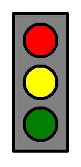
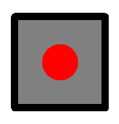

# 🐢 Завдання до теми №4. 

## 1️⃣ Резиновий "Світлофор"

Черепашка хоче намалювати світлофор, який можна дуже швидко змінювати під певні розміри.  
- діаметра внутрішніх кружків  
- відступу від краю рамки та кружками    
- товщину пера

### Параметри

- Діаметр круга —  **`diametr`**
- Відступ від краю рамки — **`margin`**
- Товщина пера — **`pen_s`**
- Колір рамки — чорний
- Колір фону — світло-сірий

📌 **Підказка:**  
- Використай змінні `diametr` та `margin` для позиціонування кругів  
- Всі три круги повинні стояти один під одним всередині рамки  

### Як має виглядати результат

## 2️⃣ 🎲 Гральний кубик: одиничка
Черепашка вирішила продовжити свої ігри з гральними кубиками.
Цього разу вона хоче намалювати гральний кубик, на грані якого буде показано число 1.  
Але потрібно створити програму, щоб розміри кубика можна було б швидко змінювати.  

### Параметри:
- Сторона кубика - **`a` пікселів**
- Товщина пера — **в 10 разів менша за сторону кубика**
- Радіус точки — **в 5 разів менший за сторону кубика**
- Колір точки - **червоний**

### Як має виглядати результат

## 3️⃣ Шестикутник, вписаний у коло

Черепашка вирішила намалювати правильний шестикутник,  
який **вписаний у коло**.

Це означає, що **всі вершини шестикутника лежать на колі**.

### 🧠 Цікава підказка

У правильного шестикутника, вписаного в коло:

> **довжина сторони дорівнює радіусу кола**

Саме цю властивість потрібно використати у програмі.

### Умови завдання

У програмі потрібно:  
- використати **змінну для радіуса кола**  
- поверх кола намалювати **правильний шестикутник**  

❗ Не пиши числа напряму в командах — використовуй змінну.

📌 **Підказка:**  
Кут повороту для шестикутника дорівнює **60°**.

### Як має виглядати результат

---

