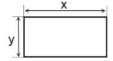
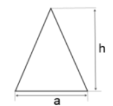
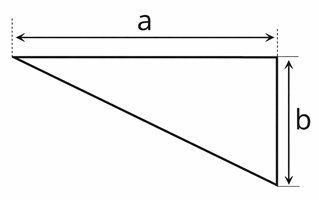
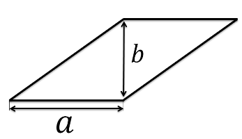

# Завдання до теми №5. Система координат 🐢📍  

## 1️⃣ Малюнок по точках 

Черепашка отримала готові **реальні координати** фігури.  
Якщо з’єднати ці точки **у правильному порядку**, на екрані з’явиться малюнок

Твоє завдання:  
- з’єднати точки та додати деталь — **око**  
- підібрати розмір ока  
- зафарбувати малюнок відповідним кольором  
- встановити колір фону (на свій розсуд)

### 🔹 Контур 
```
(0, 80), (-20, 80), (-40, 60), (-80, 60), (-80, 40), (-40, 20), 
(-20, 0), (-60, -40), (-60, -120), (-40, -140), (80, -140), 
(140, -80), (100, -60), (40, -60), (0, -20), (0, 0), (20, 0), 
(40, 20), (40, 60), (20, 80), (0, 80) 
```
### 👁️ Око
```
(-10, 60)
```

---

## 2️⃣ Мишеня по точках 🐭

Черепашка отримала готові **реальні координати** фігури.  
Якщо з’єднати всі точки **у правильному порядку**, на екрані з’явиться **мишеня**.

Твоє завдання:  
- з’єднати точки та додати деталь — **око**  
- намалювати **хвіст**  
- підібрати розмір ока  
- зафарбувати малюнок відповідним кольором  
- встановити колір фону на свій розсуд

### 🔹 Контур мишеняти 
```
(75,-100), (75,-25), (50,75), (50,125), (75,150), (75,200),
(50,225), (25,225), (-25,175), (-25,150), (-100,100), (-50,75),
(-25,75), (-25,25), (-50,25), (-50,-25), (-25,0), (-25,-100),
(-50,-100), (-50,-150), (-75,-150), (-75,-175), (-25,-175),
(-25,-125), (25,-125), (25,-150), (75,-150), (75,-175), (100,-175),
(100,-125), (50,-125), (75,-100)

```

### 🔹 Хвіст
```
(75,-75), (125,-75), (125,75)
```

### 👁️ Око 
```
(-25,125)
```

Звісно! 🐺
Ось **повна задача у форматі md** для уроку Turtle із вовком, із масштабом 25 для реальних координат, підказками та очікуваним результатом.

---


## 3️⃣ Вовк по точках 🐺

Черепашка отримала готові **реальні координати** фігури.  
Якщо з’єднати всі точки **у правильному порядку**, на екрані з’явиться **вовк**.

Твоє завдання:  
- з’єднати точки контуру вовка  
- намалювати **око** або додаткові деталі  
- зафарбувати малюнок  
- встановити колір фону на свій розсуд

---

### 🔹 Контур вовка 

```

(-225,125), (-175,125), (-150,150), (-125,150), (-100,175), (-100,150),
(-25,75), (200,75), (250,25), (250,-100), (225,-125), (225,-25),
(175,-175), (125,-175), (150,-150), (150,-100), (125,-50), (125,-25),
(75,-50), (0,-25), (-75,-50), (-75,-175), (-125,-175),
(-100,-150), (-100,-25), (-150,75), (-225,100), (-225,125)

```

### 👁️ Око 

```

самостійно визнач розмір та координати ока

```

---
## 4️⃣ Прямокутник по точках із сторонами `a` та `b` пікселів 

Створи програму, у якій черепашка намалює прямокутник зі сторонами `a` та `b` пікселів, лівий нижній кут має координати (0, 0):

### 🔧 Параметри:
- Колір лінії: чорний
- Товщина лінії: 5 пікселів
- Швидкість: 1

### Підказка:
`a` та `b` - це змінні, які визначають ширину і висоту прямокутника  

### Як має виглядати результат 


---
## 5️⃣ Квадрат по точках із стороною `a` пікселів  

Створи програму, у якій черепашка намалює квадрат зі стороною `a` пікселів, верхній правий кут має координати `(x, y)`:

### 🔧 Параметри:
- Колір лінії: чорний
- Товщина лінії: 5 пікселів
- Швидкість: 1

### Підказка:
`a` — це змінна, яка визначає розмір сторони квадрата.  
`x` та `y` — координати верхнього правого кута.

### Як має виглядати результат 


---

## 6️⃣ Рівнобедрений трикутник по точках із основою `a` та висотою `h`  

Створи програму, у якій черепашка намалює рівнобедрений трикутник,  
основа якого має довжину `a` пікселів, а висота — `h` пікселів.

Ліва точка основи має координати `(x, y)`.

### 🔧 Параметри:
- Колір лінії: чорний
- Товщина лінії: 5 пікселів
- Швидкість: 1

### Підказка:
`a` — довжина основи трикутника.  
`h` — висота трикутника.  
`x`, `y` — координати лівої точки основи.

### Як має виглядати результат 


---  

## 7️⃣ Ромб по точках із шириною `a` та висотою `b`  

Створи програму, у якій черепашка намалює ромб,  
ширина якого дорівнює `a` пікселів, а висота — `b` пікселів.

Нижня вершина ромба має координати `(x, y)`.

### 🔧 Параметри:
- Колір лінії: чорний
- Товщина лінії: 5 пікселів
- Швидкість: 1

### Підказка:
`a` — горизонтальна ширина ромба.  
`b` — вертикальна висота ромба.  
`x`, `y` — координати нижньої вершини ромба

### Як має виглядати результат 


---

## 8️⃣ Прямокутний трикутник по точках із катетами `a` та `b`  

Створи програму, у якій черепашка намалює прямокутний трикутник,  
у якого горизонтальний катет має довжину `a` пікселів,  
а вертикальний катет — `b` пікселів.

Початкова точка — **правий нижній кут** трикутника з координатами `(x, y)`.

### 🔧 Параметри:
- Колір лінії: чорний
- Товщина лінії: 5 пікселів
- Швидкість: 1

### Підказка:
`a` — довжина горизонтального катета.  
`b` — довжина вертикального катета.  
`x`, `y` — координати правого нижнього кута.

### Як має виглядати результат 


---

## 9️⃣ Паралелограм по точках із основою `a` та висотою `b`  

Створи програму, у якій черепашка намалює паралелограм,  
у якого нижня основа має довжину `a` пікселів,  
а висота — `b` пікселів.

Початкова точка — **лівий нижній кут** паралелограма з координатами `(x, y)`.

### 🔧 Параметри:
- Колір лінії: чорний
- Товщина лінії: 5 пікселів
- Швидкість: 1

### Підказка:
`a` — довжина основи паралелограма.  
`b` — висота паралелограма.  
`x`, `y` — координати лівого нижнього кута.

### Як має виглядати результат 


---

## 🔟 Ромб (повітряний змій) по точках із діагоналями `a` та `b`  

Створи програму, у якій черепашка намалює ромб,  
у якого **горизонтальна діагональ** має довжину `a` пікселів,  
а **вертикальна діагональ** — `b` пікселів.

Центр ромба має координати `(x, y)`.

### 🔧 Параметри:
- Колір лінії: чорний
- Товщина лінії: 5 пікселів
- Швидкість: 1

### Підказка:
`a` — довжина горизонтальної діагоналі.  
`b` — довжина вертикальної діагоналі.  
`x`, `y` — координати центра ромба.

### Як має виглядати результат 

