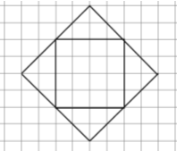
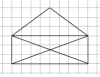

# Завдання до теми: Малюнки по клітинках 🐢📍  

### 1️⃣ TASK_01
Створи програму, у якій черепашка намалює візерунок по клітинках.

⚠️ Важливі умови: 
- черепашка не може рухатися по лініях, які вже були намальовані.  
- заборонено підіймати олівець (перо)  

📌 Початок координат знаходиться в лівому нижньому куті.

### 🔧 Параметри:
- Розмір клітинки `k = 30`
- Колір лінії: синій
- Товщина лінії: 5 пікселів
- Швидкість: 1

### Як має виглядати результат 

---

### 2️⃣ TASK_02
Створи програму, у якій черепашка намалює візерунок по клітинках.

>📌 Початкова точка — верхній кут фігури.  
>Вона задається координатами (x, y).

⚠️ Важливі умови:  
- Черепашка не може рухатися по лініях, які вже були намальовані.  
- Дозволяється лише один раз підняти олівець, перейти в початкову точку та знову опустити його.  

### 🔧 Параметри:
- Розмір клітинки `k = 25`
- Колір лінії: синій
- Товщина лінії: 5 пікселів
- Швидкість: 1

### Як має виглядати результат 

---

### 3️⃣ TASK_03
Створи програму, у якій черепашка намалює візерунок по клітинках.

>📌 Початкова точка — **правий нижній** кут фігури.  
>Вона задається координатами (x, y).

⚠️ Важливі умови:  
- Черепашка не може рухатися по лініях, які вже були намальовані.  
- Дозволяється лише один раз підняти олівець, перейти в початкову точку та знову опустити його.  

### 🔧 Параметри:
- Розмір клітинки `k = 25`
- Колір лінії: синій
- Товщина лінії: 5 пікселів
- Швидкість: 1

### Як має виглядати результат 

---

### 4️⃣ TASK_04
Створи програму, у якій черепашка намалює візерунок по клітинках.

>📌 Початкова точка — **верхній** кут фігури.  
>Вона задається координатами (x, y).

⚠️ Важливі умови:  
- Черепашка не може рухатися по лініях, які вже були намальовані.  
- Дозволяється лише один раз підняти олівець, перейти в початкову точку та знову опустити його.  

### 🔧 Параметри:
- Розмір клітинки `k = 25`
- Колір лінії: синій
- Товщина лінії: 5 пікселів
- Швидкість: 1

### Як має виглядати результат 

---

### 5️⃣ TASK_04
Створи програму, у якій черепашка намалює візерунок по клітинках.

>📌 Початкову точку — **виберіть самостійно**.  
>Вона задається координатами (x, y).

⚠️ Важливі умови:  
- Черепашка не може рухатися по лініях, які вже були намальовані.  
- Дозволяється лише один раз підняти олівець, перейти в початкову точку та знову опустити його.  

### 🔧 Параметри:
- Розмір клітинки `k = 25`
- Колір лінії: синій
- Товщина лінії: 5 пікселів
- Швидкість: 1

### Як має виглядати результат 

---